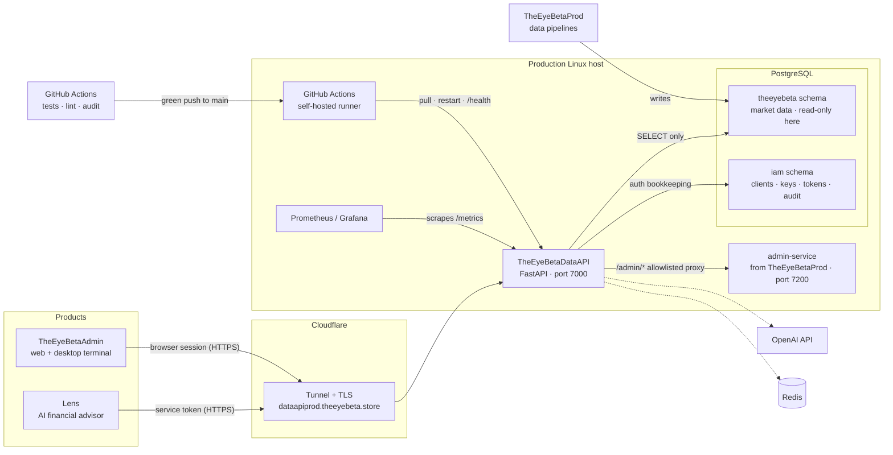

# Architecture

Simple and accurate rather than polished. Solid lines are production traffic;
dotted lines are optional.

## How a request flows

1. A product calls `https://dataapiprod.theeyebeta.store/api/v1/...` with a
   bearer token. Lens gets its token by exchanging its client credentials at
   `POST /api/v1/auth/service-token`.
2. Cloudflare terminates HTTPS and forwards over an outbound-only tunnel to
   the API on `127.0.0.1:7000`. The server has no open inbound port.
3. The API checks the host header, rate limit, token signature and expiry,
   required scope, and (in production) live policy: tenant locks and
   credential revocations.
4. The route calls a service, which calls a repository. Only repositories
   contain SQL. They connect as the least-privilege `api_service` database role.
5. Responses are validated against a schema. Errors always have the shape
   `{"error": {"code", "message", "request_id"}}`.

## Boundaries

| Component | Owned by | This repo's access |
|---|---|---|
| `theeyebeta` schema (prices, fundamentals, signals, macro, policy tables) | TheEyeBetaProd | Read-only |
| `iam` schema (service clients, API keys, refresh tokens, audit log, users) | This repo (`deploy/iam_*.sql`) | Column-scoped writes; no deletes |
| admin-service (MFA, RBAC, admin mutations) | TheEyeBetaProd | Proxied through an allowlist; identity is not interpreted here |
| Cloudflare Tunnel config | Operator; this repo declares only its own hostnames (`deploy/cloudflared-config.yml`) | Shared with Prod and Local; routing table in `docs/OWNERSHIP.md`, open decision DEBT-01 |

## Third-party dependencies

| Service | Used for | If it is down |
|---|---|---|
| Cloudflare | Public HTTPS entry | API unreachable from outside the host |
| GitHub / GitHub Actions | Source, CI, deploy trigger | No deploys; the running service is unaffected |
| OpenAI (optional) | Advisor chat wording | Chat falls back to a plain data summary |
| Redis (optional) | Shared rate-limit counters | Falls back to in-process counters |
